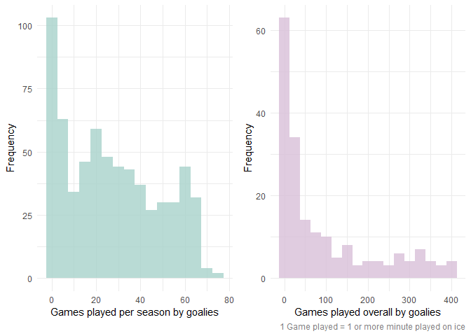
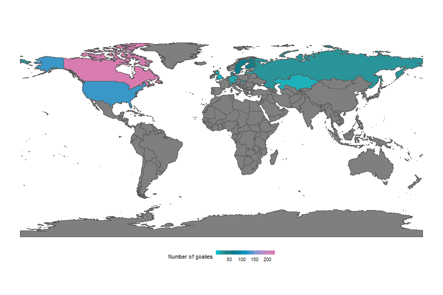
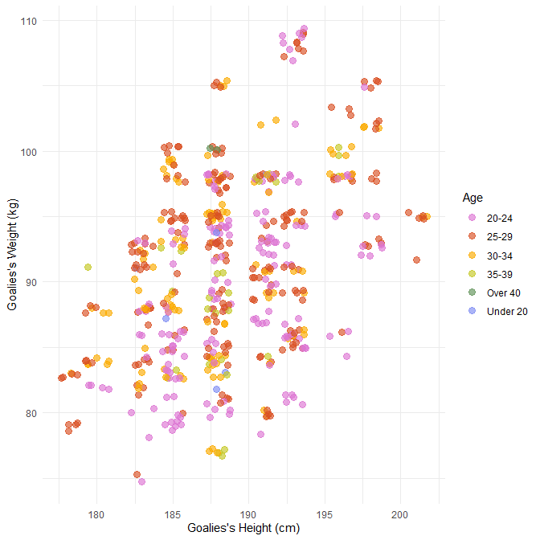
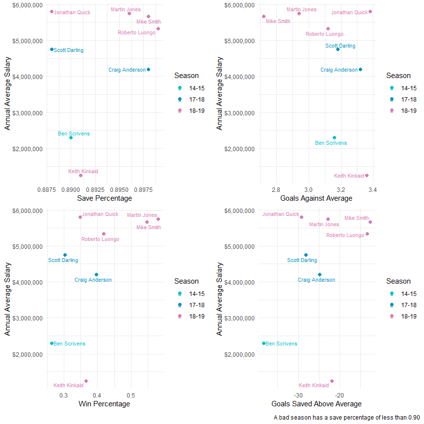

NHL Goalie Evaluation
================

## Introduction

-----

NHL goalies are kind of an enigma. They’re notoriously hard to evaluate
and predict in a sport that is already so chaotic. They are also
incredibly important to their teams and often you will hear hockey
analysts citing teams’ goalies as the reason that the team is preforming
well or poorly.

We are interested specifically in evaluating NHL goalies for the purpose
of understanding their contracts. How do teams decide how much to pay
their goalies? We want to inspect goalies in the post-lockout seasons
and take a look at the best, the worst and how much they get paid.

## Objective

-----

The objective of this report is to evaluate NHL goalies and their
contracts in the post-lockout era and then build a model to try and
predict how much goalies should be getting paid.

## NHL Goalies

-----

We wanted to specifically preform this analysis during the post-lockout
era (2013-present). Hockey has changed so much in these seasons,
comparing goalies from post-lockout era hockey to pre-lockout doesn’t
quite make sense.

### Overview of Goalies

How many unique goalies played per season?

``` r
hr_data %>%
  distinct(player, szn) %>%
  count(szn, name = 'Number of goalies') %>%
  rename(Season = szn)
```

    ## # A tibble: 7 x 2
    ##   Season `Number of goalies`
    ##   <chr>                <int>
    ## 1 12-13                   82
    ## 2 13-14                   97
    ## 3 14-15                   92
    ## 4 15-16                   92
    ## 5 16-17                   95
    ## 6 17-18                   95
    ## 7 18-19                   93

We see that \~95 goalies played each season. This may seem like a lot
but this actually makes sense. From 2013-2017 there were 30 NHL teams in
the league and from 2017-2019 there were 31. Each NHL team usually has a
starting goalie, a back-up goalie, and a third-string “emergency”
goalie. Teams calling-up goalies from their farm teams in emergency
situations is also common. So you would assume that **number of teams in
league \* 3** is the approximate number of goalies who play each season.

##### Fact: In 2018-19, between goalies getting constantly blown out and injured, the Philadelphia Flyers were infamous for their goaltending trouble. They iced *8 goalies* during the regular season, the highest of any team post-lockout.

``` r
read_csv('data/flyers_goaliedata_19.csv') %>%
  clean_names() %>%
  arrange(desc(gp)) %>%
  select(Player = player, Team = tm, `Games played` = gp, `Save %` = sv_percent)
```

    ## # A tibble: 8 x 4
    ##   Player          Team  `Games played` `Save %`
    ##   <chr>           <chr>          <dbl>    <dbl>
    ## 1 Carter Hart     PHI               31    0.917
    ## 2 Brian Elliott   PHI               26    0.907
    ## 3 Anthony Stolarz PHI               12    0.902
    ## 4 Calvin Pickard  PHI               11    0.863
    ## 5 Michal Neuvirth PHI                7    0.859
    ## 6 Cam Talbot      PHI                4    0.881
    ## 7 Alex Lyon       PHI                2    0.806
    ## 8 Mike McKenna    PHI                1    0.833

In total there were 187 goalies that played at least 1 game in the NHL
from 2013-2019. However, it makes no sense to evaluate a goalie based on
their performance in just a few games because of the variation between
events occuring in each hockey game. One of the many mysteries
surrounding goalies is after how many games can we draw definitive
conclusions about their quality of play. Let’s look at how many games
goalies were playing per season and over their whole careers.

``` r
gp_szn <-
  ggplot(hr_data, aes(gp)) +
  geom_histogram(binwidth = 5, fill = '#a7d2cb', alpha = 0.8) +
  labs(x = 'Games played per season by goalies', y = 'Frequency') +
  theme(plot.caption = element_text(color = 'grey50'))

gp_overall <-
  hr_data %>%
  group_by(player) %>%
  summarise(gp = sum(gp)) %>%
  ggplot(aes(gp)) +
  geom_histogram(binwidth = 25, fill = 'thistle', alpha = 0.8) +
  labs(x = 'Games played overall by goalies', y = 'Frequency',
       caption = '1 Game played = 1 or more minute played on ice') +
  theme(plot.caption = element_text(color = 'grey50'))

gp_szn + gp_overall
```



In the case of this analysis, we were interested specifically in goalies
who had played 40 or more games in the NHL from 2013-2019. Our reasoning
behind this is that a full NHL season is 82 games so 40 games is about
half a “season” played and seems like a reasonably large enough sample
to evaluate a goalie’s play. The one downside to this evaluation is that
it will devalue the contributions of back-up goalies, but back-up
goalies usually don’t last as long as starters anyway and thus, their
contracts tend to stay around league minimum.

### Goalie demographics

It is well-known that most hockey players origniate from North America,
Russia, or Scandinavia. Is this true for goalies specifically?

``` r
goalie_countries <- 
  cf_data %>%
    count(country, name = "num_of_goalies") %>%
    na.omit()

world <- 
  ne_countries(
    scale = "medium", 
    returnclass = "sf"
  )

world %>%
  left_join(goalie_countries, by = c('name' = 'country')) %>%
  ggplot() +
  geom_sf(aes(fill = num_of_goalies)) +
  labs(fill = "Number of goalies") + 
  scale_fill_fish(option = 'Scarus_globiceps') +
  theme_void() +
  theme(legend.position = "bottom",
        legend.key.height = unit(2, 'mm'),
        legend.text = element_text(size = 7),
        legend.title = element_text(size = 8))
```



We can see that this holds true for goalies for the most part, but it’s
interesting to note that there are goalies who originate from Denmark
and even the UK.

The old hockey idea is that goalies are supposed to be **big**. The
taller and wider they are, the more space they take up in the net.
However, with the evolution of hockey skill came the need for more
athletic goalies with lightning reflexes. The butterfly style, now
commonplace in the NHL, requires goalies to be flexible. So what do
goalies look like in the NHL now?

``` r
cf_data_player_height_weight <- 
  cf_data %>%
  select(player, weight, height, age, country) %>%
  mutate(
    weight = parse_number(sub(".*-","", weight)), 
    height = parse_number(sub(".*-","",height))
    ) %>%
  mutate(age = case_when(
    age < 20 ~ 'Under 20',
    age >= 20 & age < 25 ~ '20-24',
    age >= 25 & age < 30 ~ '25-29',
    age >= 30 & age < 35 ~ '30-34',
    age >= 35 & age < 40 ~ '35-39',
    age > 40 ~ 'Over 40',
  ))

p <-
  cf_data_player_height_weight %>%
  ggplot(aes(height, weight)) +
  geom_jitter(aes(color = age), 
              alpha = 0.65, size = 3) +
  labs(x = 'Goalies\'s Height (cm)', 
       y = 'Goalies\'s Weight (kg)', 
       color = 'Age') +
  scale_color_fish_d(option = 'Callanthias_australis')

p
```



So we can see that the largest chunck of goalies seems to fall between
183 - 193cm (6’0 - 6’3 ft) in height and 85 - 95kg (187 - 210lbs) in
weight. So only slightly taller and heavier than the average adult male,
which is what you would expect from a professional athelete but is not
quite what you would expect if you tend to think of goalies as big
players.

### The Best (and Worst) of the NHL

We wanted to see some how much the best and the worst goalies are
getting paid. This is to see if they are getting over paid becuse they
are not preforming well, or to see if a team is getting a good deal by
not paying too much for a really goog goalie.

We used four different metrics to determine how good a goalie is. The
first is **save percentage** which is the percent of shots the goalie
allows in compared to all shots faced. The second is **goals against
average**, which is the average of goals that the goalie let in during a
game. The third is *percentage of how many games the goalie won*. The
final metric is **goals saved above average** which shows the average
goals saved compared to the league average.

#### The top 10 averages by goalies over the past 6 seasons

Let’s find out who the top 10 goalies were over the past 6 seasons.

``` r
hr_data <- hr_data %>% mutate(w_percent = w/gp)

Salaries <- cf_data %>% 
  group_by(player) %>% 
  summarise(mean_aav = mean(aav)) %>% 
  mutate(player = replace(player,player == "Marc-André Fleury","Marc-Andre Fleury")) %>%
  mutate(player = replace(player,player == "Jaroslav Halák","Jaroslav Halak")) %>% 
  mutate(player = replace(player, player == "Eddie Läck","Eddie Lack")) %>% 
  mutate(player = replace(player, player == "Jacob Markström","Jacob Markstrom")) %>%
  mutate(player = replace(player, player == "Petr Mrázek","Petr Mrazek"))

Best_Goalies <- 
  hr_data %>% 
  filter(!(player == "Martin Jones" & szn == "14-15")) %>%
  group_by(player) %>% 
  summarise(gp = sum(gp),
            w = sum(w),
            ga = sum(ga),
            sa = sum(sa),
            sv = sum(sv),
            ) %>%
  filter(gp > 120) %>% 
  mutate(mean_w_percent = w/gp, 
         mean_sv_percent = sv/sa,
         mean_gaa = ga/gp,
         avg_sv = mean(mean_sv_percent),
         mean_gsaa = (sa * (1-avg_sv))- ga,
         )

Best_Goalies <- Best_Goalies %>% 
  left_join(Salaries, by = c("player" = "player"))

Mean_sv_plot <- 
  Best_Goalies %>% 
  top_n(10, mean_sv_percent) %>%
  ggplot(aes(x = mean_sv_percent, y = mean_aav)) + 
  geom_point(size = 2, color = '#a7d2cb') +
  geom_text_repel(aes(label = player), size = 3) +
  labs(x = "Save Percentage", y = "Average Annual Salary")+
  scale_y_continuous(labels = scales::dollar)

Mean_gaa_plot <- 
  Best_Goalies %>% 
  top_n(-10, mean_gaa) %>%
  ggplot(aes(x = mean_gaa, y = mean_aav)) + 
  geom_point(size = 2, color = '#f2d388') +
  geom_text_repel(aes(label = player), size = 3) +
  labs(x = "Goals Against Average", y = "Average Annual Salary")+
  scale_y_continuous(labels = scales::dollar)

mean_w_percent_plot <- 
  Best_Goalies %>% 
  top_n(10, mean_w_percent) %>% 
  ggplot(aes(x = mean_w_percent, y = mean_aav)) + 
  geom_point(size = 2, color = '#c98474') + 
  geom_text_repel(aes(label = player), size = 3) +
  labs(x = "Percentage of Games Won", y = "Average Annual Salary")+
  scale_y_continuous(labels = scales::dollar)

mean_gsaa_plot <- 
  Best_Goalies %>% 
  top_n(10, mean_gsaa) %>% 
  ggplot(aes(x = mean_gsaa,y = mean_aav))+ 
  geom_point(size = 2, color = '#874c62') + 
  geom_text_repel(aes(label = player), size = 3) +
  labs(x = "Goals Saved Above Average", y = "Average Annual Salary")+
  scale_y_continuous(labels = scales::dollar)

(Mean_sv_plot | Mean_gaa_plot) / (mean_w_percent_plot | mean_gsaa_plot)
```


From the graphs we can see some common names pop up between the four
metrics, for example Carey Price, Sergei Bobrovsky are all names really
good goalies and that is why they get paid around 7 Million per year on
average.

Some other good goalies that are making around 3 Million per year are
Matt Murray, Andrei Vasilevskiy. Those teams are getting a good deal for
top quality goaltending.

#### Top goalies by season

We then just wanted to see what the top goalie was in each metric for
any particular season.

``` r
# Finding the best goalies by Season
# creates tables for each stat we are looking at

top_goalie_sv <- function(season){
  top_goalie_stats <- hr_data %>% filter(szn == season, gp > 40) 
  top_goalie_sv_percent <- top_goalie_stats %>% top_n(1,sv_percent) %>%
    select(player, sv_percent, szn)
  return(top_goalie_sv_percent)
}

top_goalie_gaa <- function(season){
  top_goalie_stats <- hr_data %>% 
    filter(szn == season, gp > 40)
  goalie_gaa <- top_goalie_stats %>% 
    top_n(-1,gaa) %>% 
    select(player, gaa, szn)
  return(goalie_gaa)
}


top_goalie_w_percent <- function(season){
  top_goalie_stats <- hr_data %>% filter(szn == season, gp > 40)
  goalie_w_percent <- top_goalie_stats %>% top_n(1,w_percent) %>% 
    select(player, w_percent, szn)
  return(goalie_w_percent)
}


top_goalie_gsaa <- function(season){
  top_goalie_stats <- hr_data %>% filter(szn == season, gp > 40)
  goalie_gsaa <- top_goalie_stats %>% top_n(1,gsaa) %>% 
    select(player, gsaa, szn)
  return(goalie_gsaa)
}

#Loop to fill in the tables

best_sv_year <- tibble()
best_gaa_year <- tibble()
best_win_percent_year <- tibble()
best_gsaa_year <- tibble()
for (i in 1:7){
  best_sv_year <- bind_rows(best_sv_year,top_goalie_sv(hr_szns[i]))
  best_gaa_year <- bind_rows(best_gaa_year,top_goalie_gaa(hr_szns[i]))
  best_win_percent_year <- bind_rows(best_win_percent_year,top_goalie_w_percent(hr_szns[i]))
  best_gsaa_year <- bind_rows(best_gsaa_year,top_goalie_gsaa(hr_szns[i]))
}


#Plots to see best goalies by season 


sv_plot <- 
  best_sv_year %>% 
  ggplot(aes(x = szn, y = sv_percent)) + 
  geom_point(size = 2, color = '#a7d2cb') +
  geom_text_repel(aes(label = player), size = 3) +
  coord_flip() + 
  labs(x = "Season", y = "Save Percentage")

gaa_plot <- 
  best_gaa_year %>% 
  ggplot(aes(x =szn, y = gaa)) + 
  geom_point(size = 2, color = '#f2d388') +
  geom_text_repel(aes(label = player), size = 3) +
  coord_flip() + 
  labs(x = "Season", y = "Goals Against Average")

w_percent_plot <- 
  best_win_percent_year %>% 
  ggplot(aes(x = szn, y = w_percent)) + 
  geom_point(size = 2, color = '#c98474') + 
  geom_text_repel(aes(label = player), size = 3) +
  coord_flip() + 
  labs(x = "Season", y = "Win Percentage")

gsaa_plot <- 
  best_gsaa_year %>% 
  ggplot(aes(x = szn, y = gsaa)) + 
  geom_point(size = 2, color = '#874c62') + 
  geom_text_repel(aes(label = player), size = 3) +
  coord_flip() + 
  labs(x = "Season", y = "Goals Saved Above Average")

year_plots <- (sv_plot | gaa_plot) / (w_percent_plot | gsaa_plot)

year_plots 
```


From here we see some of the names again that appeared on the top
averages graph. Notibly Carey Price and Sergei Bobrovsky. We also want
to point out that many of the top goalies per season were with the team
that either won the Stanely Cup or are with a team that was in the top
of the standings. This will be shown later when we see who the goalies
were for the top preforming teams.

#### Worst Goalies over past seasons

Now that we took a look at the best performing goalies, it is only fair
that we analyze the 10 worst performing goalies over the past 6 seasons.

``` r
#Worst Goalies by averages overall

worst_mean_sv_plot <- Best_Goalies %>% 
  top_n(-10,mean_sv_percent) %>%
  ggplot(aes(x = mean_sv_percent, y = mean_aav)) + 
  geom_point(size = 2, color = '#a7d2cb') +
  geom_text_repel(aes(label = player), size = 3) +
  labs(x = "Save Percentage", y = "Average Annual Salary") +
  scale_y_continuous(labels = scales::dollar)

worst_mean_gaa_plot <- Best_Goalies %>% 
  top_n(10,mean_gaa) %>%
  ggplot(aes(x = mean_gaa, y = mean_aav)) + 
  geom_point(size = 2, color = '#f2d388') +
  geom_text_repel(aes(label = player), size = 3) +
  labs(x = "Goals Against Average", y = "Average Annual Salary")+
  scale_y_continuous(labels = scales::dollar)

worst_mean_w_percent_plot <- Best_Goalies %>% 
  top_n(-10, mean_w_percent) %>% 
  ggplot(aes(x = mean_w_percent, y = mean_aav)) + 
  geom_point(size = 2, color = '#c98474') + 
  geom_text_repel(aes(label = player), size = 3) +
  labs(x = "Percentage of Games Won", y = "Average Annual Salary")+
  scale_y_continuous(labels = scales::dollar)


worst_mean_gsaa_plot <- Best_Goalies %>% 
  top_n(-10, mean_gsaa) %>% 
  ggplot(aes(x = mean_gsaa,y = mean_aav))+ 
  geom_point(size = 2, color = '#874c62') + 
  geom_text_repel(aes(label = player), size = 3) +
  labs(x = "Goals Saved Above Average", y = "Average Annual Salary")+
  scale_y_continuous(labels = scales::dollar)


Worst_average_plots <- (worst_mean_sv_plot | worst_mean_gaa_plot) / (worst_mean_w_percent_plot | worst_mean_gsaa_plot)

Worst_average_plots 
```


There is one goalie to pay attention too on this chart, and that is Cam
Ward. He is one of the worst performing goalies on average over the past
6 seasons with one the highest salaries that is around $5 Million a
year. He has the lowest Save percentage and the worst goals saved above
average with a -70 goals saved. Interesting to note that that Cam Ward
carried his team to a Stanley Cup however in 2006 while posting a 0.882
save percentage.

Mike Smith is another high paid goalie that is constantly bad with his
goals against average and games won. The other goalies are all pad a
lower amount that is around $2M per year, which means that their teams
luckily are not spending too much money on a bad goalie.

#### Worst goalies over last 6 seasons

We wanted to see who were some of the truly worst goalies in the past 6
seasons. A truly bad goalie has a save percentage of less than 0.9 in
the season and has played more than 40 games.

``` r
# Some really bad goalies by year 

missing_salary <- 
  read_xls("data/MH_nhl_goalies_2017-2018.xls") %>% 
  clean_names() %>% 
  unite('player', c('first_name', 'last_name'), sep = ' ') %>% 
  filter(player == "Scott Darling") %>% 
  select(player, salary)

worst_goalies <- hr_data %>%
  filter(gp > 40 & sv_percent < 0.9)

worst_salaries <- cf_data %>% select(player, aav, szn)

worst_goalies <- worst_goalies %>% 
  left_join(worst_salaries,by = c("player" = "player", "szn" = "szn")) %>%
  left_join(missing_salary, by = c("player" = "player")) %>% 
  mutate(aav = replace_na(aav,0)) %>% 
  mutate(salary = replace_na(salary,0)) %>% 
  mutate(aav = aav+ salary) %>% 
  unite('player_szn', c('player','szn'), sep = ' | Season:', remove = FALSE) %>%
  select(-salary) %>%
  mutate(w_percent = w/gp)

wg_sv_percent <- worst_goalies %>% 
  ggplot(aes(x = sv_percent, y = aav, color = szn)) + 
  geom_point(size = 2) +
  geom_text_repel(aes(label = player), size = 3) +
  labs(x = "Save Percentage", y = "Annual Average Salary", color = "Season") +
  scale_color_fish_d(option = 'Scarus_globiceps') +
  scale_y_continuous(labels = scales::dollar)

wg_gsaa <- worst_goalies %>% 
  ggplot(aes(x = gsaa, y = aav, color = szn)) + 
  geom_point(size = 2) +
  geom_text_repel(aes(label = player), size = 3) +
  labs(x = "Goals Saved Above Average", y = "Annual Average Salary", color = "Season")+
  scale_color_fish_d(option = 'Scarus_globiceps')+
  scale_y_continuous(labels = scales::dollar)

wg_gaa <- worst_goalies %>% 
  ggplot(aes(x = gaa, y = aav, color = szn)) + 
  geom_point(size = 2) + 
  geom_text_repel(aes(label = player), size = 3) +
  labs(x = "Goals Against Average", y = "Annual Average Salary", color = "Season") +
  scale_color_fish_d(option = 'Scarus_globiceps')+
  scale_y_continuous(labels = scales::dollar)

wg_w_percent <- worst_goalies %>% 
  ggplot(aes(x = w_percent, y = aav, color = szn)) + 
  geom_point(size = 2) + 
  geom_text_repel(aes(label = player), size = 3) +
  labs(x = "Win Percentage", y = "Annual Average Salary", color = "Season") +
  scale_color_fish_d(option = 'Scarus_globiceps')+
  scale_y_continuous(labels = scales::dollar)

Worst_goalies_plot <- (wg_sv_percent | wg_gaa) / (wg_w_percent | wg_gsaa)
Worst_goalies_plot + plot_annotation(
   caption = 'A bad season has a save percentage of less than 0.90'
 )
```



From the charts we see that there are only 8 goalies who had a really
bad season since the lockout. Most of them got paid over 4M for that
year. Some notable mentions include Johnathan Quick who had his worst
season in 2018-2019. He is a declining performing goalie who once led
his team to two Stanley Cups in his prime. Martin Jones had a bad season
in 2018-2019 as well and his team lost in the conference finals in the
Stanley Cup. Roberto Luongo was another great goalie back in 2010 who
led team Canada to a Gold medal in the Vancouver Olympics and led the
Vancouver Canucks to game 7 of the Stanely Cup final.

Mike Smith is getting paid way to much since he has no track record like
some of the other goalies in this category. He really should not be
getting paid what he is since the the other goalies mentioned above were
on long term contracts and are nearing the end of their carreer.

#### First place team goalie performance

A phenonmeon surrounding goalies is that a goalie preforming well
generally correlates with their team preforming well and vice versa. One
has to wonder if the goalie has this effect on their team (i.e. implying
that a good goalie can make a team be good) or if a good team inflates a
goalies perceived quality (i.e. implying that a good team makes a good
goalie). Obviously there are other factors that could be considered in
team and goalie quality but to isolate this question a bit, let’s
investigate the performance of the goalies belonging to the first place
team in the league (most points at the end of the regular season) over
the last couple seasons.

###### The triangle point is league average.

``` r
league_avgs <-
  hr_data %>%
  filter(gp > 20) %>%
  group_by(szn) %>%
  summarise(
    avg_sv_percent = mean(sv_percent),
    avg_gaa = mean(gaa)
  ) %>%
  ungroup()

starting_goalies_best <- 
  standings_data %>%
  filter(rk == 1) %>%
  select(-w, -l, -ol, -pts) %>%
  left_join(read_csv('data/NHLTeams.csv')) %>%
  left_join(hr_data, by = c('abbrev' = 'team', 'szn' = 'szn')) %>%
  group_by(team, szn) %>%
  top_n(1, gp) %>%
  select(szn, player, sv_percent, gaa) %>%
  ungroup()

first_place_goalies <- 
  starting_goalies_best %>%
  left_join(league_avgs, by = 'szn') %>%
  mutate(sv_percent_diff = sv_percent - avg_sv_percent,
         gaa_diff = gaa - avg_gaa)

starting_goalies_sv_percent <- 
  ggplot(first_place_goalies) +
    geom_point(aes(x = szn, y = sv_percent, color = sv_percent_diff), 
               size = 4) +
    geom_point(aes(x = szn, y = avg_sv_percent),
               show.legend = F, size = 3, color = 'grey30', shape = 17) +
    geom_text_repel(aes(x = szn, y = sv_percent, label = player), 
                    size = 3) +
    labs(y = 'Save percent', x = NULL, color = 'Differential') +
    ggtitle('League Average vs First Place save percent') +
    scale_color_fish(option = 'Scarus_globiceps') +
    coord_flip() +
    theme(legend.position = 'top',
          legend.text = element_text(size = 6),
          legend.title = element_text(size = 8),
          legend.key.height = unit(2, 'mm'),
          plot.title = element_text(hjust = 0.5))

starting_goalies_gaa <- 
  ggplot(first_place_goalies) +
  geom_point(aes(x = szn, y = gaa, color = gaa_diff), 
             size = 4) +
  geom_point(aes(x = szn, y = avg_gaa),
             show.legend = F, size = 3, color = 'grey30', shape = 17) +
  geom_text_repel(aes(x = szn, y = gaa, label = player), 
                  size = 3) +
  labs(y = 'Goals against avg', x = NULL, color = 'Differential') +
  ggtitle('League Average vs First Place GAA') +
  scale_color_fish(option = 'Scarus_globiceps', direction = -1) +
  coord_flip() +
  theme(legend.position = 'top',
        legend.text = element_text(size = 6),
        legend.title = element_text(size = 8),
        legend.key.height = unit(2, 'mm'),
        plot.title = element_text(hjust = 0.5))

starting_goalies_comb <- starting_goalies_sv_percent / starting_goalies_gaa
starting_goalies_comb
```


A lot of these goalies were goalies that showed up in the section about
best goalies in the NHL, and we can see that first place teams got some
truly great goaltending, outpreforming league average by quite a bit
each season. We could draw the conclusion that a good goalie tends to
have a correlation with team success.

## Goalie Contracts

-----

Now, we will dive into goalie contracts. How much have goalies been
getting paid in the last 6 seasons and how has that been changing? Have
contract values been going up or down? Who gets paid the most and do
they work hard for the money?

When analyzing goalie contracts, most emphasis was put on analyzing the
*average annual value* (AAV) of the contract (i.e. how much they make
per year). The way contracts work in the NHL (and most professional
sports with a salary cap) can be confusing. Some contracts are
front-heavy (get paid the majority of the contract in the first few
years), some are padded with bonuses from the signing teams, some have
salary retention from previous teams. All of this is done to try and
circumvent the salary cap, on a team management level. Thus, we feel
it’s safe to analyze goalies using their AAV since using actual salary
would be hard to understand, interpret, and every salary varies from
goalie to goalie and team to team. At the end of the day, every goalie
gets the full-value of their contract and its easy to understand and
interepret as if they got paid an equal amount of their contract every
season.

### How much goalies get paid

So on average how much has an NHL goaltender, who has played more than
40 NHL games, gotten paid?

``` r
aav_gp_data <-
  cf_data %>%
  select(player, aav, szn) %>%
  left_join(
    cf_data %>%
      group_by(player) %>%
      summarise(gp = sum(gp)), 
    by = 'player'
  ) %>%
  filter(gp > 40)

aav_gp_data %>%
  mutate(szn = paste0(20, szn)) %>%
  ggplot(aes(szn, aav, color = szn, fill = szn)) +
  geom_violin(alpha = 0.8,
              show.legend = F, trim = T, width = 0.9) +
  geom_boxplot(width = 0.1, color = 'grey90', fill = 'grey50', alpha = 0.1) +
  labs(x = NULL, y = 'Average annual value ($)') +
  #ggtitle('Distribution of goalie average annual value') +
  scale_y_continuous(labels = scales::dollar) +
  fishualize::scale_color_fish_d(option = 'Scarus_globiceps') +
  fishualize::scale_fill_fish_d(option = 'Scarus_globiceps') +
  theme_classic() +
  theme(axis.line = element_blank(),
        axis.text.x = element_text(size = 12, color = 'grey25'),
        axis.text.y = element_text(size = 7, color = 'grey25'),
        axis.title.y = element_text(size = 9, color = 'grey25', face = 'italic'),
        plot.title = element_text(hjust = 0.5, size = 16, color = 'grey15', face= 'italic'))
```


Another way goalies are weird is that goalies in the past have not
usually made as much as their skater teammates. This is starting to
change however. For example, Carey Price signed a contract extension
that took effect in the 18-19 season for $10.5M per year over 8 years,
$84M in total by the time the contract is up (see above plot). This was
an unprecedented signing at the time, but as teams start to value good,
consistent goalies more and more, we are likely to see more high-valued
goalie contracts. We can see from the plot that the median AAV has
shifted in the past two seasons from $2M to closer to $3M. Also the AAV
distribution is more spread out in the last couple seasons, instead of
being clumped all near the lower end.

### Contract inflation

We saw from the previous section that the median AAV has risen about a
$1M in the last two seasons. In general, players are signing much bigger
contracts in these recent years than before. Contracts are inflating
such that where a $6M contract for a goalie used to be *huge*, it might
become standard for starting goaltenders in the next couple years to be
making around $6M AAV.

To investigate contract inflation, we can look at the median AAV in each
expiry year of current signed contracts.

``` r
cf_data %>%
  select(exp_year, aav) %>% 
  group_by(exp_year) %>%
  mutate(med_aav = median(aav)) %>%
  ggplot(aes(exp_year, med_aav)) +
  geom_step(color = 'turquoise3', size = 1) +
  geom_rug(position = 'jitter', color = 'grey30', alpha = 0.8, sides = 'right') +
  labs(x = 'Contract expiry year', y = 'Median average annual value of contract') +
  scale_y_continuous(labels = scales::dollar) +
  theme_classic() +
  theme(axis.line = element_blank())
```


The plot proves our point about contract inflation since the median AAV
upon contract expiry is rising with each year. It’s important to note
the data density at each year (represented by the clustered dashes on
the opposite axes). There are much less contracts signed past 2023 right
now and therefore the median is only being calculated between 1-2 star
player contracts (Carey Price at $10.5M). The dramatic increase past
2024 will be dampered a bit by goalies signing smaller deals that expire
in past 2024.

### Top paid players post-lockout

So do goalies “deserve” the money they get? As we pointed out before,
it’s hard to know whether a good goalie makes a good team or vice
versa. But if we put stock into the idea that the goalie might be the
most important player on a team, then the ones who are getting paid
well, should be *really* good.

``` r
## Get top 10 paid players in league over last 7 years
top_10_paid <- 
  cf_data %>%
    group_by(player) %>%
    top_n(1, aav) %>%
    ungroup() %>%
    distinct(player, aav, team) %>%
    top_n(10, aav)

## Plot top 10 paid players
top_10_paid %>%
  mutate(team = substr(team, start = str_length(team) - 2, stop = str_length(team))) %>%
  mutate(player = paste0(player, '\n(', team, ')     ')) %>%
  ggplot() +
  geom_segment(aes(x = reorder(player, aav), xend = player, y = 0, yend = aav), color = 'grey30') +
  geom_point(aes(x = player, y = aav, color = aav), size = 5, show.legend = F) +
  labs(x = NULL, y = 'Average annual value') +
  coord_flip() +
  scale_color_fish(option = 'Scarus_globiceps') +
  scale_y_continuous(labels = scales::dollar) +
  theme_classic() +
  theme(axis.line = element_blank(),
        axis.text.y = element_text(size = 10, color = 'grey25'),
        plot.title = element_text(hjust = 0.5, size = 16, color = 'grey25', face= 'italic'))
```


From the section on the Best and Worst goalies of the NHL, this top 10
most paid is actually very interesting. For example, we saw goalies
*Carey Price*, *Henrik Lundqvist*, *Sergei Bobrovsky*, *Tukka Rask*, and
*Corey Crawford* all show up in our look at the best goalies in the NHL.
While *Braden Holtby* has never really posted elite numbers, he has been
the goalie for the first place team (Washington Capitals) twice in the
last 6 seasons and won the Stanley cup with them in 17-18. We would say
that these goalies deserve to be in the top 10 most paid and seem to
actually work hard for the money.

However, we saw Cam Ward and Corey Schneider show up in our worst
goalies in the NHL sections. They have not posted even mediocre numbers
in the last 6 seasons and yet continue to be very well paid. We would
consider these bad-value contracts for these teams.

## How Much Should Goalies Be Making

-----

We are also interested to see if we can predict (or correct) goalie
contracts. We collected goalie statistics and data from various sources
including advanced goalie statistics to create a multivariate linear
regression model. Thus, given the input data, we will have an idea of
how much a goalie should be making.

The first step was to combine all our data sources and take a look at
our possible predictors. While combining and prepping the data, we also
remove the data from goalies who we want to run through the model once
it’s built.

``` r
## Prep and combine data

cf_reg_data <- 
  cf_data %>%
  mutate(
    ## Removes accents off names
    player = stri_trans_general(player, 'latin-ascii'),
    ## Transform all names to lowercase
    player = str_to_lower(player)) %>%
    ## Remove redundant cols
    select(-weight, -height, -pos, -team, -age, -gp, -w, -l, -so, -gaa, -sv_percent)

hr_reg_data <-
  hr_data %>%
  ## Transform all names to lowercase
  mutate(player = str_to_lower(player)) %>%
  # Filter for post lockout szns
  filter(szn != '12-13') %>%
  # Fix nicknames
  mutate(player = case_when(
    str_detect(player, 'cal heeter') ~ str_replace(player, 'cal heeter', 'calvin heeter'),
    str_detect(player, 'matt o\'connor') ~ str_replace(player, 'matt o\'connor', 'matthew o\'connor'),
    str_detect(player, 'eddie pasquale') ~ str_replace(player, 'eddie pasquale', 'edward pasquale'),
    TRUE ~ as.character(player)
  ))

mp_reg_data <- 
  mp_data %>%
  # Filter data for all situations (5v5, player-down, player-up)
  filter(situation == 'all', szn != '12-13') %>%
  # Remove redundant cols
  select(-player_id, -team, -season, -position, -games_played, 
         -penality_minutes, -penalties, -situation, -goals) %>%
  # Transform all names to lowercase
  mutate(name = str_to_lower(name)) %>%
  # Fix nicknames
  mutate(name = case_when(
    str_detect(name, 'tom mccollum') ~ str_replace(name, 'tom mccollum', 'thomas mccollum'),
    str_detect(name, 'j.f. berube') ~ str_replace(name, 'j.f. berube', 'jean-francois berube'),
    str_detect(name, 'j-f berube') ~ str_replace(name, 'j-f berube', 'jean-francois berube'),
    str_detect(name, 'cal petersen') ~ str_replace(name, 'cal petersen', 'calvin petersen'),
    TRUE ~ as.character(name)
  ))

# Join all data together
joined_data <-
  hr_reg_data %>%
  full_join(mp_reg_data, by = c('player' = 'name', 'szn' = 'szn')) %>%
  inner_join(cf_reg_data, by = c('player', 'szn')) %>%
  # Remove extra contract info (since we don't "know" this information yet)
  select(-rk, -cap_hit_percent, -salary, -length, -cap_hit) %>%
  # Same variable as "min" (minutes played)
  select(-icetime)

# Final prep of data
reg_data <- 
  joined_data %>%
  # Code binary variables
  mutate(handed = ifelse(handed == 'Left', 0, 1),
         expiry = ifelse(expiry == 'UFA', 0, 1)) %>%
  # Filter out players whos contracts we want to predict
  filter(!player %in% c('sergei bobrovsky', 'mikko koskinen')) %>%
  # Select numeric predictors
  select_if(is.numeric)

reg_data %>%
  ncol()
```

    ## [1] 59

We can see that there are *way* too many predictors (59 columns). So
before we build our model, we want to conduct feature selection to
reduce the number of predictors in our model.

#### Feature selection

To do the feature selection, we calculated the information gain for each
predictor with response variable AAV, then subsetted for the 10
predictors with the highest amount of information gain.

    ##                      attribute attr_importance
    ## 1                    x_on_goal       0.3475705
    ## 2       play_continued_in_zone       0.3460936
    ## 3                     x_freeze       0.3452192
    ## 4      unblocked_shot_attempts       0.3448691
    ## 5     x_play_continued_in_zone       0.3431743
    ## 6                          min       0.3424588
    ## 7             low_danger_shots       0.3386594
    ## 8  play_continued_outside_zone       0.3380047
    ## 9          medium_danger_goals       0.3355798
    ## 10           low_dangerx_goals       0.3345546

Now that we have the 10 variables with the most information gain, we can
use these variables to build our model and then evaluate.

``` r
## Model
mod <- lm(aav~., feat_selected)

# Coefficient summary
mod %>% 
  tidy()
```

    ## # A tibble: 11 x 5
    ##    term                        estimate std.error statistic    p.value
    ##    <chr>                          <dbl>     <dbl>     <dbl>      <dbl>
    ##  1 (Intercept)                  466920.   105716.     4.42  0.0000122 
    ##  2 x_on_goal                     19286.     7423.     2.60  0.00963   
    ##  3 play_continued_in_zone         5148.     2894.     1.78  0.0758    
    ##  4 x_freeze                     -15608.    22488.    -0.694 0.488     
    ##  5 unblocked_shot_attempts       -1133.     1253.    -0.905 0.366     
    ##  6 x_play_continued_in_zone     -24863.    10100.    -2.46  0.0142    
    ##  7 min                             971.      522.     1.86  0.0635    
    ##  8 low_danger_shots               5220.     3195.     1.63  0.103     
    ##  9 play_continued_outside_zone     874.     2854.     0.306 0.760     
    ## 10 medium_danger_goals           25866.    12121.     2.13  0.0333    
    ## 11 low_dangerx_goals           -277297.    61164.    -4.53  0.00000720

``` r
# Full model summary
mod %>%
  glance() %>%
  select(1:6)
```

    ## # A tibble: 1 x 6
    ##   r.squared adj.r.squared    sigma statistic  p.value    df
    ##       <dbl>         <dbl>    <dbl>     <dbl>    <dbl> <int>
    ## 1     0.532         0.523 1434524.      59.4 1.22e-79    11

Looking at our model summary, we see that the only variables that are
significant at a level of significance of \(\alpha\) = 0.05 other than
the model intercept are `x_play_continued_in_zone` (expected play
continued in the goalies’ zone after a shot is taken) and
`low_danger_xgoals` (expected goals in low danger situations), and
`x_on_goal` (expected on goal shots in all situations). We are
interested in running the model with just these predictors to see if we
can get a better fit (by looking at the `adj.r.squared` value).

``` r
## Model
mod2 <- lm(aav ~ x_play_continued_in_zone + low_dangerx_goals + x_on_goal, data = feat_selected)

# Coefficient summary
mod2 %>% 
  tidy()
```

    ## # A tibble: 4 x 5
    ##   term                     estimate std.error statistic    p.value
    ##   <chr>                       <dbl>     <dbl>     <dbl>      <dbl>
    ## 1 (Intercept)               486184.   102795.      4.73 0.00000289
    ## 2 x_play_continued_in_zone  -14161.     8008.     -1.77 0.0776    
    ## 3 low_dangerx_goals        -237505.    55571.     -4.27 0.0000228 
    ## 4 x_on_goal                  17393.     4326.      4.02 0.0000665

``` r
# Full model summary
mod2 %>%
  glance() %>%
  select(1:6)
```

    ## # A tibble: 1 x 6
    ##   r.squared adj.r.squared    sigma statistic  p.value    df
    ##       <dbl>         <dbl>    <dbl>     <dbl>    <dbl> <int>
    ## 1     0.522         0.519 1440296.      193. 1.97e-84     4

The adjusted \(R^2\) value for this single predictor model is *slightly*
smaller than for the full 10 predictor model, so we say that the other
variables add to the fit of the model, and will use the full model to
make our predictions.

### Predictions

Our model assesses AAV on an individual season basis, so when doing
predictions we have to select which season we want to base our
predictions on. The goalies we are interested in investigating are two
high-profile goalie contracts that were signed last year: Sergei
Bobrovsky and Mikko Koskinen.

#### Sergei Bobrovsky

Bobrovsky got paid $10M AAV when he signed his new contract for this
season (until 2026). Assuming we were evaluting Bobrosky in a vaccumm of
only his most recent season statistics (2018-19), what does our model
say his AAV should have been?

``` r
bob_data <- 
  joined_data %>%
  filter(player == 'sergei bobrovsky', szn == '18-19') %>%
  select(subset_info_gain)

tibble(predicted = predict(mod, bob_data))
```

    ## # A tibble: 1 x 1
    ##   predicted
    ##       <dbl>
    ## 1  4136760.

This is *significantly* less than what Bobrovsky was actually making in
the 2018-19 season.

#### Mikko Koskinen

Mikko Koskinen was a hot-topic goalie last year because he played less
than 20 NHL games in total before the general manager of the Edmonton
Oilers (Koskiken’s team) signed him to an extension of $4.5M AAV
(effective 2019-20 season) over 3 years. As we’ve seen in this report,
$4.5M was significantly over the average salary for a goalie in the NHL
last season. This contract was heavily critisized because there wasn’t
an adequate sample size to gauge Koskinen on and there was no rush to
sign him. Peter Chiarelli, the GM of the Edmonton Oilers at the time,
was already under fire for his many other poor signings and was fired
less than 2 weeks after this signing in particular.

We’re curious to see if our model agrees with how much Chiarelli valued
Koskinen at, based on Koskinen’s full season performance after he signed
the contract.

``` r
kosk_data <-
  joined_data %>%
  filter(player == 'mikko koskinen') %>%
  select(subset_info_gain)

tibble(predicted = predict(mod, kosk_data))
```

    ## # A tibble: 1 x 1
    ##   predicted
    ##       <dbl>
    ## 1  3534802.

Our model actually values Koskinen at $3.5M, $1M less than what
Chiarelli signed him for.

## Conclusions

-----

Goalie contracts are some of the hardest to evaluate in hockey. Some
goalies get paid a lot for being the most important player on their
team, however some get paid way too much just to underperform. Some
goalies are playing really well and aren’t making what they’re worth,
but with the way we can see contracts inflating, especially for elite
goaltending, they are likely to get big pay days in the coming seasons,
as well as drive up the market-value for goalies.

It is possible that goalies may become the highest paid players in the
NHL in the coming years since teams seem to be more willing to shell-out
for decent goaltending, as it becomes clearer that goalies contribute in
a large way to their teams success or failure.

## Data Sources

-----

  - HockeyReference
    (<https://www.hockey-reference.com/leagues/NHL_2019_goalies.html#stats>::none)
  - CapFriendly
    (<https://www.capfriendly.com/browse/active/2019/caphit/all/goalies>)
  - MoneyPuck (<http://moneypuck.com/data.htm>)
  - MetaHockey
    (<http://metahockey.com/resources/data/sources/compiled/>)

## References

-----

### Report formatting

  - Side navigation menu
    (<https://bookdown.org/yihui/rmarkdown/html-document.html>)
  - Theme
    (<https://www.datadreaming.org/post/r-markdown-theme-gallery/>)
  - Horizontal lines
    (<https://holtzy.github.io/Pimp-my-rmd/#horizontal_lines>)
  - Custom CSS
    (<https://bookdown.org/yihui/rmarkdown/custom-css-1.html>)
  - Tables
    (project.org/web/packages/kableExtra/vignettes/awesome\_table\_in\_html.html\#table\_styles)
  - Links (<https://rmarkdown.rstudio.com/authoring_basics.html>)

### Graphics

  - <https://github.com/ropensci/rnaturalearth>
  - <https://github.com/nschiett/fishualize>
  - <https://www.r-graph-gallery.com/bubble_chart_interactive_ggplotly.html>
  - <https://stackoverflow.com/questions/36325154/how-to-choose-variable-to-display-in-tooltip-when-using-ggplotly>
  - <https://ggplot2.tidyverse.org/reference/geom_rug.html>

### Goaltenders and Goaltending

  - <https://www.omha.net/news_article/show/631894-the-evolution-of-different-goaltending-styles>
  - <https://www.sportsnet.ca/hockey/nhl/oilers-koskinen-contract-extension-questions/>
  - <https://www.sportsnet.ca/hockey/nhl/panthers-sign-sergei-bobrovsky-seven-year-70m-deal/>

## Appendix

-----

``` r
sessionInfo()
```

    ## R version 3.6.1 (2019-07-05)
    ## Platform: x86_64-w64-mingw32/x64 (64-bit)
    ## Running under: Windows 10 x64 (build 17763)
    ## 
    ## Matrix products: default
    ## 
    ## locale:
    ## [1] LC_COLLATE=English_Canada.1252  LC_CTYPE=English_Canada.1252   
    ## [3] LC_MONETARY=English_Canada.1252 LC_NUMERIC=C                   
    ## [5] LC_TIME=English_Canada.1252    
    ## 
    ## attached base packages:
    ## [1] stats     graphics  grDevices utils     datasets  methods   base     
    ## 
    ## other attached packages:
    ##  [1] broom_0.5.2         kableExtra_1.1.0    FSelector_0.31     
    ##  [4] stringi_1.4.3       ggthemes_4.2.0      lubridate_1.7.4    
    ##  [7] readxl_1.3.1        janitor_1.2.0       patchwork_0.0.1    
    ## [10] ggrepel_0.8.1       plotly_4.9.1        fishualize_0.1.0   
    ## [13] sp_1.3-1            sf_0.8-0            rnaturalearth_0.1.0
    ## [16] ggsci_2.9           teamcolors_0.0.3    forcats_0.4.0      
    ## [19] stringr_1.4.0       dplyr_0.8.3         purrr_0.3.3        
    ## [22] readr_1.3.1         tidyr_1.0.0         tibble_2.1.3       
    ## [25] ggplot2_3.2.1       tidyverse_1.2.1    
    ## 
    ## loaded via a namespace (and not attached):
    ##  [1] httr_1.4.1              jsonlite_1.6           
    ##  [3] viridisLite_0.3.0       RWeka_0.4-41           
    ##  [5] modelr_0.1.5            assertthat_0.2.1       
    ##  [7] cellranger_1.1.0        yaml_2.2.0             
    ##  [9] pillar_1.4.2            backports_1.1.5        
    ## [11] lattice_0.20-38         glue_1.3.1             
    ## [13] digest_0.6.21           snakecase_0.11.0       
    ## [15] rvest_0.3.4             randomForest_4.6-14    
    ## [17] colorspace_1.4-1        htmltools_0.4.0        
    ## [19] pkgconfig_2.0.3         haven_2.1.1            
    ## [21] webshot_0.5.1           scales_1.0.0           
    ## [23] generics_0.0.2          ellipsis_0.3.0         
    ## [25] withr_2.1.2             lazyeval_0.2.2         
    ## [27] cli_1.1.0               magrittr_1.5           
    ## [29] crayon_1.3.4            evaluate_0.14          
    ## [31] fansi_0.4.0             nlme_3.1-141           
    ## [33] xml2_1.2.2              class_7.3-15           
    ## [35] tools_3.6.1             data.table_1.12.4      
    ## [37] RWekajars_3.9.3-2       hms_0.5.1              
    ## [39] lifecycle_0.1.0         munsell_0.5.0          
    ## [41] entropy_1.2.1           compiler_3.6.1         
    ## [43] e1071_1.7-2             rlang_0.4.0            
    ## [45] classInt_0.4-2          units_0.6-5            
    ## [47] grid_3.6.1              rstudioapi_0.10        
    ## [49] htmlwidgets_1.5.1       labeling_0.3           
    ## [51] rmarkdown_1.16          gtable_0.3.0           
    ## [53] DBI_1.0.0               R6_2.4.0               
    ## [55] gridExtra_2.3           knitr_1.25             
    ## [57] rgeos_0.5-2             utf8_1.1.4             
    ## [59] zeallot_0.1.0           KernSmooth_2.23-16     
    ## [61] rJava_0.9-11            Rcpp_1.0.2             
    ## [63] vctrs_0.2.0             rnaturalearthdata_0.1.0
    ## [65] tidyselect_0.2.5        xfun_0.10
