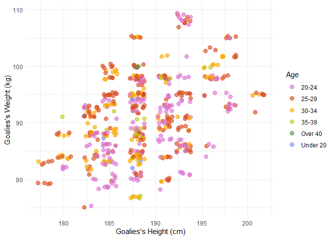
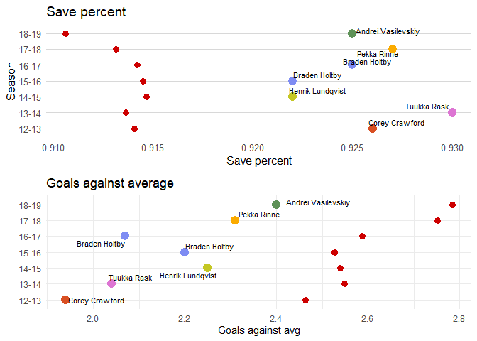

NHL Goalie Evaluation
================

## Introduction

-----

NHL goalies are kind of an enigma. They’re notoriously hard to evaluate
and predict in a sport that is already so chaotic. They are also
incredibly important to their teams and often you will hear hockey
analysts citing teams’ goalies as the reason that the team is preforming
well or poorly.

We are interested specifically in evaluating NHL goalies for the purpose
of understanding their contracts. How do teams decide how much to pay
their goalies? We want to inspect goalies in the post-lockout seasons
and take a look at the best, the worst and how much they get paid.

## Objective

-----

The objective of this report is to evaluate NHL goalies and their
contracts in the post-lockout era and then build a model to try and
predict how much goalies will get paid on their next contract.

## NHL Goalies

-----

We wanted to specifically preform this analysis during the post-lockout
era (2013-present). Hockey has changed so much in these seasons,
comparing goalies from post-lockout era hockey to pre-lockout doesn’t
quite make sense.

### Overview of Goalies

How many unique goalies played per season?

    ## # A tibble: 7 x 2
    ##   Season `Number of goalies`
    ##   <chr>                <int>
    ## 1 12-13                   82
    ## 2 13-14                   97
    ## 3 14-15                   92
    ## 4 15-16                   92
    ## 5 16-17                   95
    ## 6 17-18                   95
    ## 7 18-19                   93

We see that \~95 goalies played each season. This may seem like a lot
but this actually makes sense. From 2013-2017 there were 30 NHL teams in
the league and from 2017-2019 there were 31. Each NHL team usually has a
starting goalie, a back-up goalie, and a third-string “emergency”
goalie. Teams calling-up goalies from their farm teams in emergency
situations is also common. So you would (assuming that injuries are
uniform) that `number of teams in league * 3` is the approximate number
of goalies who play each season.

In total there were 187 goalies that played at least 1 game in the NHL
from 2013-2019. However, it makes no sense to evaluate a goalie based on
their performance in just a few games because of the variation between
events occuring in each hockey game. One of the many mysteries
surrounding goalies is after how many games can we draw definitive
conclusions about their quality of play? Let’s look at how many games
goalies were playing per season and over their whole careers.

In the case of this analysis, we were interested specifically in goalies
who had played 40 or more games in the NHL from 2013-2019. Our reasoning
behind this is that a full NHL season is 82 games so 40 games is about
half a “season” played and seems like a reasonably large enough sample
to evaluate a goalie’s play. The one downside to this evaluation is that
it will devalue the contributions of back-up goalies, but back-up
goalies usually don’t last as long as starters anyway and thus, their
contracts tend to stay around league minimum.

##### Fact: In 2018-19, between goalies getting constantly blown out and injured, the Philadelphia Flyers were infamous for their goaltending trouble. They iced *8 goalies* during the regular season, the highest of any team post-lockout.

    ## # A tibble: 8 x 4
    ##   Player          Team  `Games played` `Save %`
    ##   <chr>           <chr>          <dbl>    <dbl>
    ## 1 Carter Hart     PHI               31    0.917
    ## 2 Brian Elliott   PHI               26    0.907
    ## 3 Anthony Stolarz PHI               12    0.902
    ## 4 Calvin Pickard  PHI               11    0.863
    ## 5 Michal Neuvirth PHI                7    0.859
    ## 6 Cam Talbot      PHI                4    0.881
    ## 7 Alex Lyon       PHI                2    0.806
    ## 8 Mike McKenna    PHI                1    0.833

### Goalie demographics

It is well-known that most hockey players origniate from North America,
Russia, or Scandinavia. Is this true for goalies specifically?

We can see that this holds true for goalies for the most part, but it’s
interesting to note that there are goalies who originate from Denmark
and even the UK.

The old hockey idea is that goalies are supposed to be **big**. The
taller and wider they are, the more space they take up in the net.
However, with the evolution of hockey skill came the need for more
athletic goalies with lightning reflexes. The butterfly style, now
commonplace in the NHL, requires goalies to be flexible. So what do
goalies look like in the NHL now?

So we can see that the largest chunck of goalies seems to fall between
183 - 193cm (6’0 - 6’3 ft) in height and 85 - 95kg (187 - 210lbs) in
weight. So only slightly taller and heavier than the average adult male,
which is what you would expect from a professional athelete but is not
quite what you would expect if you tend to think of goalies as big
players.

### The Best (and Worst) of the NHL

#### The top 10 averages by goalie

#### Top goalies by season

#### Worst Goalies over past seasons

#### Worst goalies over last 6 seasons

#### First place team goalie performance

Red point is league average.

## Goalies Contracts

-----

  - show how much goalies get paid
  - how has that changed over time? (line plot)
  - Do this depend on how good their team is?

## How Contracts Affect Pay

-----

  - How good are goalies that got paid a lot? (vice versa)

## How Much Will Goalies Get Paid

-----

  - how many goalies are we looking at?
  - show where the goalies are from (it could be a single plot since
    most of the goalies will be the same over the years), what do they
    look like? (height & weight)
      - plot showing where they are from
      - plot showing height/weight
  - who are the best ones?
      - plot of their avg szn

## Conclusions

-----

  - how many goalies are we looking at?
  - show where the goalies are from (it could be a single plot since
    most of the goalies will be the same over the years), what do they
    look like? (height & weight)
      - plot showing where they are from
      - plot showing height/weight
  - who are the best ones?
      - plot of their avg szn

## Data

-----

  - how many goalies are we looking at?
  - show where the goalies are from (it could be a single plot since
    most of the goalies will be the same over the years), what do they
    look like? (height & weight)
      - plot showing where they are from
      - plot showing height/weight
  - who are the best ones?
      - plot of their avg szn

## References

-----

### Data

  - HockeyReference
  - CapFriendly
  - MoneyPuck
  - MetaHockey

### Report formatting

  - Side navigation menu:
    <https://bookdown.org/yihui/rmarkdown/html-document.html>
  - Theme: <https://www.datadreaming.org/post/r-markdown-theme-gallery/>
  - Horizontal lines:
    <https://holtzy.github.io/Pimp-my-rmd/#horizontal_lines>
  - Custom CSS: <https://bookdown.org/yihui/rmarkdown/custom-css-1.html>
